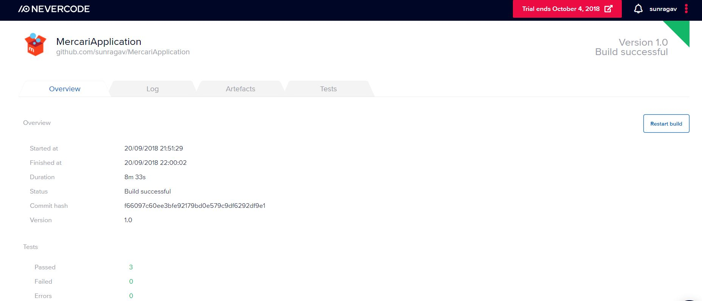

# MercariApplication
### Choice A: A sample app for training
An Application that looks like the Mercari App, loads products based on the static json files from AWS S3 URL , in a tab layout using viewpager.
The application is built using Dagger2(for dependency injections), Android architecture components( Viewmodel, LiveData, MutableLiveData), Moshi(JSON adapter), AutoValue ( for generating the equals, hashcode and other useful boilerplate generations for the models), Retrofit( for network calls), ButterKnife(for view bindings).
The app follows the (Model View ViewModel) MVVM architecture where the ViewModel is contructed by extending the ViewModel of android architecture comonents.

The apps dependencies are satisfied using the Dagger2.0 library.

## The following is the dependency diagram:

The packaging structure has been maintained in such a way that all the logical pieces of the application has a package name and their dependency injection related files are placed in the "di" folder as shown in the image below.

### NetWorkModule provides the retrofit(for the service calls) and the moshi adapter(for the JSON seraialization and deserializations)
```java
@Module
public abstract class NetworkModule {

    private static final String BASE_URL = "https://s3-ap-northeast-1.amazonaws.com";
    @Provides
    @Singleton
    static Moshi provideMoshi() {
        return new Moshi.Builder()
                .add(AdapterFactory.create())
                .build();
    }
    @Provides
    @Singleton
    static Retrofit provideRetrofit(Moshi moshi) {
        return new Retrofit.Builder()
                .baseUrl(BASE_URL)
                .addConverterFactory(MoshiConverterFactory.create(moshi))
                .build();
    }

    @Provides
    @Singleton
    static RepoService provideRepoService(Retrofit retrofit) {
        return retrofit.create(RepoService.class);
    }
}
```
### AcitivityBuilder Module uses the Dagger2 multibinding to bind the factory of the MainActivity with the MainActivity.class as a key.
```java
@Module
public abstract class ActivityBuilder {

    @Binds
    @IntoMap
    @ActivityKey(MainActivity.class)
    abstract AndroidInjector.Factory<? extends Activity> bindMainActivity(MainActivityComponent.Builder builder);
}
```
### MainActivityComponent injects the MainActivity using the factory provided by the ActivityBuilder modlue.
```java

@Subcomponent
public interface MainActivityComponent extends AndroidInjector<MainActivity> {

    @Subcomponent.Builder
    abstract class Builder extends AndroidInjector.Builder<MainActivity> {

        @Override
        public void seedInstance(MainActivity instance) {

        }
    }
}
```
### AppModule includes all the other subcommponents for the application.
```java
@Module(subcomponents = {
        MainActivityComponent.class,
        ProductsGridFragmentComponent.class,
})
public class AppModule {

    private final Application application;

    AppModule(Application application) {
        this.application = application;
    }

}
```
### AppComponent takes all the dependencies provided by the modules and injects them in the places requested.
```java
@Singleton
@Component(modules = {
        ActivityBuilder.class,
        FragmentBuilder.class,
        AppModule.class,
        NetworkModule.class,
        ViewModelModule.class,
})
public interface MercariApplicationComponent {
    @Component.Builder
    interface Builder {
        @BindsInstance
        Builder application(Application application);
        MercariApplicationComponent build();
    }

    void inject(MercariApplication application);

    void inject(ProductsGridFragment productGridFragment);

    void inject(MainActivity mainActivity);
}
```
### ViewModelFactory creates the ViewModel that is used by both the MainActivity and the ProductsGridFragment
```java
@Singleton
public class ViewModelFactory implements ViewModelProvider.Factory {

    private final Map<Class<? extends ViewModel>, Provider<ViewModel>> viewModels;

    @Inject
    ViewModelFactory(Map<Class<? extends ViewModel>, Provider<ViewModel>> viewModels) {
        this.viewModels = viewModels;
    }

    @NonNull
    @Override
    public <T extends ViewModel> T create(@NonNull Class<T> modelClass) {
        try {
            //noinspection unchecked
            return (T) viewModels.get(modelClass).get();
        } catch (Exception e) {
            throw new RuntimeException("Error creating view model for class: " + modelClass.getSimpleName(), e);
        }
    }
}
```java
//MainActivity.java
  protected void onCreate(Bundle savedInstanceState) {
        AndroidInjection.inject(this);
        super.onCreate(savedInstanceState);
        setContentView(R.layout.activity_main);
        ButterKnife.bind(this);
        setSupportActionBar(actionBar);
        getSupportActionBar().setIcon(R.mipmap.ic2_launcher);

        customPagerAdapter = new CustomPagerAdapter(getSupportFragmentManager());
       ** viewModel = ViewModelProviders.of(this, this.viewModelFactory).get(ProductsViewModel.class); **
        
```

```
### ViewModelModule provides the viewmodel object via the Dagger2 MultiBinding 
```java
@Module
public abstract class ViewModelModule {

    @Binds
    @IntoMap
    @ViewModelKey(ProductsViewModel.class)
    abstract ViewModel bindProductsViewModel(ProductsViewModel viewModel);
}
```
### ProductsGridFragmentComponent that injects the dependecies for the ProductFragmentComponent.
```java
@Subcomponent
public interface ProductsGridFragmentComponent extends AndroidInjector<ProductsGridFragment> {

    @Subcomponent.Builder
    abstract class Builder extends AndroidInjector.Builder<ProductsGridFragment> {

        @Override
        public void seedInstance(ProductsGridFragment instance) {

        }
    }
}
```


## Architecture

The android architecture component's viewmodel survive's configuration changes like device orientation etc.
TODO: Add Room DB to the local persistence instead of the in-memory hashmap.
The LiveData has been used to intimate the various states the service call go through like loading starts, response arrives or error occurs. On both, success as well failure the loading is propmptly stopped and error is intimated via the text field in a graceful way without exiting the app.
This is handled in the following code snippet:
 ```java
 private void fetchRepos(String category, String url) {
        Timber.d("ProductsViewModel", "fetchRepos API called for category:" + category);
        initLiveDataMap(category);
        LiveModel liveModel = liveDataMap.get(category);
        liveModel.loading.setValue(true);
        repoCall = repoService.getRepositories(url);
        repoCall.enqueue(new Callback<List<Repo>>() {
            @Override
            public void onResponse(Call<List<Repo>> call, Response<List<Repo>> response) {
                liveModel.repoLoadError.setValue(false);
                liveModel.repos.setValue(response.body());
                Timber.d("ProductsViewModel", "API call succeded for category:" + category);
                liveModel.loading.setValue(false);
                repoCall = null;
            }

            @Override
            public void onFailure(Call<List<Repo>> call, Throwable t) {
                Log.e(getClass().getSimpleName(), "Error loading repos", t);
                liveModel.repoLoadError.setValue(true);
                liveModel.loading.setValue(false);
                // liveDataMap.put(category,liveModel);
                repoCall = null;
            }
        });
    }
```
### Models
There are two types of models we have. The first one is to get the URLs to download the list of products for the respective categories.
First one is called the MasterRepo which has download urls.
```java
public abstract class MasterRepo {
    /**
     * {
     * "name": "All",
     * "data": "https://s3-ap-northeast-1.amazonaws.com/m-et/Android/json/all.json"
     * }
     */
    public abstract String name();

    public abstract String data();

    public static JsonAdapter<MasterRepo> jsonAdapter(Moshi moshi) {
        return new AutoValue_MasterRepo.MoshiJsonAdapter(moshi);
    }

}

```
The second one is the model of the content of the respective download urls.
```java
public abstract class Repo {
    /**
     * {
     * "id": "mmen1",
     * "name": "men1",
     * "status": "on_sale",
     * "num_likes": 91,
     * "num_comments": 59,
     * "price": 51,
     * "photo": "http://dummyimage.com/400x400/000/fff?text=men1"
     * }
     */
    public abstract String id();

    public abstract Long num_likes();

    public abstract Long num_comments();

    public abstract String status();

    public abstract Long price();

    public abstract String name();

    public abstract String photo();

    public static JsonAdapter<Repo> jsonAdapter(Moshi moshi) {
        return new AutoValue_Repo.MoshiJsonAdapter(moshi);
    }

}

```

### Codeflow
Intially the MainActivity requests the viewmodel to load the MasterRepo models.
```java
 viewModel = ViewModelProviders.of(this, this.viewModelFactory).get(ProductsViewModel.class);

        if (savedInstanceState == null) {
            observeViewModel();
            viewModel.fetchMasterRepos(MASTER_URL);
        } else {
            viewPager.setAdapter(customPagerAdapter);
        }
```

On successful reponse we generate the fragments dynamically based on the contents of the response and add them to the FragmentPageAdapter.
```java
 public void initAdapter(List<MasterRepo> masterRepos) {
        for (MasterRepo repo : masterRepos) {
            ProductsGridFragment productsGridFragment = new ProductsGridFragment();
            productsGridFragment.setUrl(repo.data());
            productsGridFragment.setCategory(repo.name());
            customPagerAdapter.add(productsGridFragment);
        }
        viewPager.setAdapter(customPagerAdapter);
    }
```
Once we set the adapter to the viewpager, the fragments are created and in the createView lifecycle method we make the next API call to load the repo for the respective category using the fetchRepo call on the viewmodel object.
```java
    @Override
    public void onViewCreated(View view, @Nullable Bundle savedInstanceState) {
        viewModel = ViewModelProviders.of(this, viewModelFactory).get(ProductsViewModel.class);
        boolean alreadyDownloaded = viewModel.fetchChildRepos(category, url);
        RepoListAdapter repoListAdapter = new RepoListAdapter(viewModel, category, this);
        listView.setAdapter(repoListAdapter);
        if (alreadyDownloaded) {
            repoListAdapter.setRepo(viewModel.getRepos(category).getValue());
        }
        listView.addItemDecoration(new DividerItemDecoration(getContext(), DividerItemDecoration.VERTICAL));

        listView.setLayoutManager(new GridLayoutManager(getContext(), 2));
        observeViewModel(category);
    }
```
The recycler view adapter listens for the liveData event emitted by the viewmodel as shown in the fetchRepos code snippet earlier.
Based on the response the recycler view is updated.

```java
  RepoListAdapter(ProductsViewModel viewModel, String category, LifecycleOwner lifecycleOwner) {
        viewModel.getRepos(category).observe(lifecycleOwner, repos -> {
            setRepo(repos);
        });
        setHasStableIds(true);
    }
    
    public void setRepo(List<Repo> repos) {
        if (repos == null) {
            data.clear();
            notifyDataSetChanged();
            return;
        }
        DiffUtil.DiffResult diffResult = DiffUtil.calculateDiff(new RepoDiffCallback(data, repos));
        data.clear();
        data.addAll(repos);
        diffResult.dispatchUpdatesTo(this);
    }
```


## Screenshots


# CI/CD using nevercode.io and HockeyApp (No configuration script required).





## HockeyApp Distribution (automatically distributed from nevercode.io)

